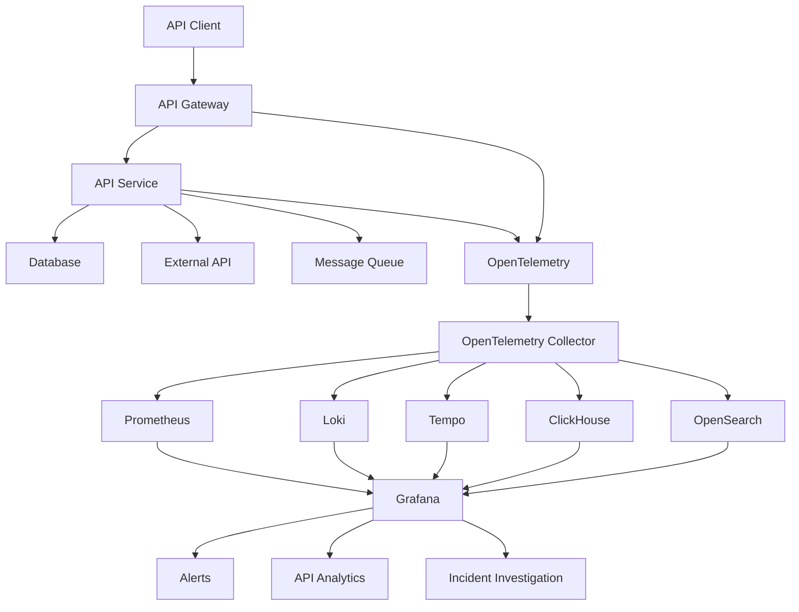

# Awesome-API-Observability

# 👁️ Top API Observability Platforms & Open-Source API Observability


> A curated list of **API observability, API monitoring, API analytics, runtime intelligence, distributed tracing, API gateways and open-source software** for understanding the health, performance, usage and behavior of modern APIs.


API observability goes beyond basic uptime monitoring.


A modern API observability platform should help engineering and platform teams answer questions such as:


* Which APIs are failing?

* Which endpoints have the highest latency?

* Which customers are affected?

* Which API versions are still being used?

* What happened across an entire request trace?

* Which downstream dependency caused the failure?

* What percentage of requests return errors?

* Which APIs are experiencing performance degradation?

* What payloads are being exchanged?

* Which APIs are unused or unexpectedly heavily used?

* Which consumers are generating abnormal traffic?

* Which API changes caused a regression?

* Which APIs violate reliability or governance requirements?


This repository focuses primarily on **open-source and self-hostable API observability infrastructure**, while maintaining a separate list of commercial platforms such as Moesif, Treblle, Akita, Dash0, Middleware, Coralogix, Datadog, New Relic, SmartBear, Kong Konnect, Observe, Elastic and Gravitee.


---


## 📑 Table of Contents


* [☁️ SaaS/Hosted Platforms](#️-saashosted-platforms)

* [🌍 Open-Source](#-open-source)

* [🔭 Open-Source API Observability Platforms](#-open-source-api-observability-platforms)

* [📡 Open-Source API Telemetry](#-open-source-api-telemetry)

* [📊 Open-Source Metrics](#-open-source-metrics)

* [🧵 Open-Source Distributed Tracing](#-open-source-distributed-tracing)

* [📝 Open-Source Logging](#-open-source-logging)

* [🔍 Open-Source API Analytics](#-open-source-api-analytics)

* [🚪 Open-Source API Gateways with Observability](#-open-source-api-gateways-with-observability)

* [⚡ Open-Source eBPF & Network Observability](#-open-source-ebpf--network-observability)

* [🧪 Open-Source API Testing & Monitoring](#-open-source-api-testing--monitoring)

* [💾 Open-Source Observability Storage](#-open-source-observability-storage)

* [📈 Open-Source Dashboards & Visualization](#-open-source-dashboards--visualization)

* [🧩 Commercial Platform → Open-Source Equivalent](#-commercial-platform--open-source-equivalent)

* [🏗️ API Observability Architecture](#️-api-observability-architecture)

* [🔄 Open-Source API Observability Architecture](#-open-source-api-observability-architecture)

* [🌐 OpenTelemetry API Observability Pipeline](#-opentelemetry-api-observability-pipeline)

* [🔬 API Golden Signals](#-api-golden-signals)

* [⚖️ Commercial vs Open-Source](#️-commercial-vs-open-source)

* [🚀 Recommended Open-Source Stacks](#-recommended-open-source-stacks)

* [📊 API Observability Technology Comparison](#-api-observability-technology-comparison)

* [🎯 Recommended Projects by Use Case](#-recommended-projects-by-use-case)

* [🏢 Building a Moesif Alternative](#-building-a-moesif-alternative)

* [🔧 Building an API Observability Platform](#-building-an-api-observability-platform)

* [🌐 Open-Source API Observability Landscape](#-open-source-api-observability-landscape)

* [🧠 Why Open-Source API Observability Matters](#-why-open-source-api-observability-matters)

* [🤝 Contributing](#-contributing)

* [⚠️ Disclaimer](#️-disclaimer)


---


# ☁️ SaaS/Hosted Platforms


Commercial API observability platforms combine telemetry collection, analytics, dashboards, alerting, distributed tracing, API discovery and sometimes API governance/security.


| Platform                                                                         | Company        | Primary Focus                 | Key Capabilities                                                                   |

| -------------------------------------------------------------------------------- | -------------- | ----------------------------- | ---------------------------------------------------------------------------------- |

| [Moesif](https://www.moesif.com/)                                                | Moesif / WSO2  | API analytics & observability | API logs, metrics, payload analytics, customer analytics, monitoring, monetization |

| [Treblle](https://treblle.com/)                                                  | Treblle        | API intelligence              | API observability, discovery, runtime intelligence, governance, security           |

| [Akita](https://www.akitasoftware.com/)                                          | Akita Software | API observability             | API behavior discovery, traffic analysis, service understanding                    |

| [Dash0](https://www.dash0.com/)                                                  | Dash0          | Observability                 | Metrics, logs, traces, OpenTelemetry and incident investigation                    |

| [Middleware](https://middleware.io/)                                             | Middleware     | Full-stack observability      | APM, logs, metrics, traces, infrastructure and API monitoring                      |

| [Coralogix](https://coralogix.com/)                                              | Coralogix      | Observability                 | Logs, metrics, traces, APM and API monitoring                                      |

| [Datadog API Monitoring](https://www.datadoghq.com/product/api-monitoring/)      | Datadog        | API monitoring                | API tests, tracing, APM, synthetic monitoring, analytics                           |

| [New Relic](https://newrelic.com/)                                               | New Relic      | APM / observability           | API monitoring, distributed tracing, logs, metrics and synthetics                  |

| [SmartBear API Hub](https://smartbear.com/api-hub/)                              | SmartBear      | API lifecycle                 | API monitoring, API quality, testing, governance and analytics                     |

| [Kong Konnect](https://konghq.com/products/kong-konnect)                         | Kong           | API platform                  | API gateway, analytics, tracing, traffic metrics and observability                 |

| [Observe](https://observeinc.com/)                                               | Observe        | Data observability            | Logs, metrics, traces and operational analytics                                    |

| [Elastic](https://www.elastic.co/)                                               | Elastic        | Observability                 | APM, logs, metrics, tracing and API analytics                                      |

| [Gravitee](https://www.gravitee.io/)                                             | Gravitee       | API management                | API analytics, gateway analytics, traffic monitoring and governance                |

| [Grafana Cloud](https://grafana.com/products/cloud/)                             | Grafana Labs   | Observability                 | Metrics, logs, traces, profiles and dashboards                                     |

| [Honeycomb](https://www.honeycomb.io/)                                           | Honeycomb      | Observability                 | High-cardinality events, tracing and debugging                                     |

| [Sentry](https://sentry.io/)                                                     | Sentry         | Application monitoring        | Errors, performance, tracing and API failures                                      |

| [Splunk Observability](https://www.splunk.com/en_us/products/observability.html) | Splunk         | Enterprise observability      | Metrics, traces, logs and infrastructure monitoring                                |

| [Dynatrace](https://www.dynatrace.com/)                                          | Dynatrace      | Enterprise observability      | APM, distributed tracing, infrastructure and API monitoring                        |

| [AppDynamics](https://www.appdynamics.com/)                                      | Cisco          | APM                           | Application performance and API monitoring                                         |

| [SolarWinds](https://www.solarwinds.com/)                                        | SolarWinds     | Infrastructure/APM            | Application and API monitoring                                                     |

| [Sematext](https://sematext.com/)                                                | Sematext       | Observability                 | Logs, metrics, tracing and API monitoring                                          |


Moesif focuses particularly strongly on **API-specific analytics**, including high-cardinality API logs, payload inspection, customer segmentation, latency analysis and API usage analytics.


Treblle positions its platform around a broader **API intelligence/runtime intelligence** layer spanning API discovery, runtime behavior, security, governance and consumer usage.


---


# 🌍 Open-Source


Unlike many commercial API observability products, open-source API observability is usually **composable**.


The most powerful approach is to combine:


```text

API Gateway

      +

OpenTelemetry

      +

Metrics

      +

Logs

      +

Distributed Traces

      +

Observability Storage

      +

Dashboards

      +

Alerting

      +

API Analytics

```


A modern open-source API observability stack can therefore look like:


```text

                         API Traffic

                              │

                              ▼

                       API Gateway

                              │

                              ▼

                    OpenTelemetry SDK

                              │

                              ▼

                  OpenTelemetry Collector

                              │

             ┌────────────────┼────────────────┐

             │                │                │

             ▼                ▼                ▼

          Metrics            Logs            Traces

             │                │                │

             ▼                ▼                ▼

        Prometheus           Loki            Tempo

             │                │                │

             └────────────────┼────────────────┘

                              ▼

                           Grafana

                              │

                              ▼

                    API Observability

```


---


# 🔭 Open-Source API Observability Platforms


These projects provide broader observability capabilities and can form the foundation of a self-hosted API observability platform.


| Project                                                                    | Description                            | Primary Strength                         |

| -------------------------------------------------------------------------- | -------------------------------------- | ---------------------------------------- |

| [SigNoz](https://github.com/SigNoz/signoz)                                 | Open-source observability platform     | Unified metrics, logs and traces         |

| [OpenObserve](https://github.com/openobserve/openobserve)                  | Observability platform                 | Logs, metrics, traces and analytics      |

| [Apache SkyWalking](https://github.com/apache/skywalking)                  | APM / observability platform           | Distributed tracing and service topology |

| [Grafana](https://github.com/grafana/grafana)                              | Visualization / observability platform | Dashboards and unified visualization     |

| [OpenTelemetry](https://github.com/open-telemetry/opentelemetry-collector) | Telemetry framework                    | Vendor-neutral instrumentation           |

| [OpenSearch](https://github.com/opensearch-project/OpenSearch)             | Search / analytics                     | Logs, traces and observability           |

| [Uptrace](https://github.com/uptrace/uptrace)                              | Open-source APM                        | OpenTelemetry-based tracing and metrics  |

| [HyperDX](https://github.com/hyperdxio/hyperdx)                            | Observability platform                 | Logs, traces and sessions                |

| [Coroot](https://github.com/coroot/coroot)                                 | Monitoring / troubleshooting           | eBPF + Kubernetes observability          |

| [GlitchTip](https://gitlab.com/glitchtip/glitchtip)                        | Error monitoring                       | Sentry-compatible error monitoring       |

| [Netdata](https://github.com/netdata/netdata)                              | Real-time monitoring                   | Infrastructure and application metrics   |

| [Zabbix](https://github.com/zabbix/zabbix)                                 | Monitoring platform                    | Infrastructure and service monitoring    |


SigNoz is particularly relevant for API observability because it combines metrics, logs and distributed tracing around OpenTelemetry rather than requiring three separate proprietary systems. OpenTelemetry's ecosystem also lists SigNoz, Jaeger, OpenSearch, Fluent Bit and other open-source observability projects.


---


# 📡 Open-Source API Telemetry


## OpenTelemetry


[OpenTelemetry](https://opentelemetry.io/) is the most important open standard/ecosystem for modern application observability.


It provides:


* Metrics

* Logs

* Distributed traces

* Context propagation

* Instrumentation

* OTLP

* Collector pipelines

* Semantic conventions

* Automatic instrumentation


For API observability, OpenTelemetry can capture:


```text

HTTP Request

     │

     ├── Method

     ├── Route

     ├── Status Code

     ├── Duration

     ├── User Agent

     ├── Service

     ├── Version

     ├── Trace ID

     └── Span ID

```


The OpenTelemetry Collector can then route telemetry to different backends.


```text

                    OpenTelemetry

                          │

                          ▼

                  OTel Collector

                          │

       ┌──────────────────┼──────────────────┐

       ▼                  ▼                  ▼

  Prometheus           Loki               Tempo

       │                  │                  │

       └──────────────────┼──────────────────┘

                          ▼

                       Grafana

```


---


# 📊 Open-Source Metrics


Metrics are the foundation of API health monitoring.


| Project                                                                              | Description                                         |

| ------------------------------------------------------------------------------------ | --------------------------------------------------- |

| [Prometheus](https://github.com/prometheus/prometheus)                               | Time-series metrics and alerting                    |

| [VictoriaMetrics](https://github.com/VictoriaMetrics/VictoriaMetrics)                | High-performance metrics database                   |

| [Mimir](https://github.com/grafana/mimir)                                            | Horizontally scalable Prometheus-compatible backend |

| [Thanos](https://github.com/thanos-io/thanos)                                        | Highly available Prometheus architecture            |

| [OpenTelemetry Collector](https://github.com/open-telemetry/opentelemetry-collector) | Telemetry collection and routing                    |

| [Netdata](https://github.com/netdata/netdata)                                        | Real-time metrics                                   |

| [Graphite](https://github.com/graphite-project/graphite-web)                         | Time-series monitoring                              |


Typical API metrics:


```text

Request Rate

Error Rate

Latency

P50

P90

P95

P99

Availability

Timeout Rate

Retry Rate

4xx Rate

5xx Rate

Request Size

Response Size

Active Requests

Saturation

```


---


# 🧵 Open-Source Distributed Tracing


Distributed tracing is critical when one API request crosses multiple services.


```text

API Gateway

     │

     ▼

Authentication

     │

     ▼

API Service

     │

     ├──────────► Database

     │

     ├──────────► Redis

     │

     └──────────► External API

```


A trace connects all of these operations.


| Project                                                                    | Description                          |

| -------------------------------------------------------------------------- | ------------------------------------ |

| [Jaeger](https://github.com/jaegertracing/jaeger)                          | Distributed tracing platform         |

| [Grafana Tempo](https://github.com/grafana/tempo)                          | High-scale tracing backend           |

| [Zipkin](https://github.com/openzipkin/zipkin)                             | Distributed tracing                  |

| [Apache SkyWalking](https://github.com/apache/skywalking)                  | APM and distributed tracing          |

| [OpenTelemetry](https://github.com/open-telemetry/opentelemetry-collector) | Tracing instrumentation / collection |

| [SigNoz](https://github.com/SigNoz/signoz)                                 | Tracing + metrics + logs             |

| [Uptrace](https://github.com/uptrace/uptrace)                              | OpenTelemetry observability          |


Grafana Tempo is an open-source distributed tracing backend designed for high-scale tracing and integrates with Grafana, Prometheus and Loki.


---


# 📝 Open-Source Logging


API logs provide detailed request-level information.


| Project                                                                       | Description                             |

| ----------------------------------------------------------------------------- | --------------------------------------- |

| [Grafana Loki](https://github.com/grafana/loki)                               | Log aggregation                         |

| [OpenSearch](https://github.com/opensearch-project/OpenSearch)                | Search and analytics                    |

| [OpenSearch Data Prepper](https://github.com/opensearch-project/data-prepper) | Observability ingestion pipeline        |

| [Fluent Bit](https://github.com/fluent/fluent-bit)                            | Lightweight log processor               |

| [Fluentd](https://github.com/fluent/fluentd)                                  | Data collection / log aggregation       |

| [Vector](https://github.com/vectordotdev/vector)                              | High-performance observability pipeline |

| [Logstash](https://github.com/elastic/logstash)                               | Data processing pipeline                |

| [Graylog](https://github.com/Graylog2/graylog2-server)                        | Log management                          |

| [OpenObserve](https://github.com/openobserve/openobserve)                     | Logs + metrics + traces                 |


Example API log:


```json

{

  "timestamp": "2026-09-10T12:00:00Z",

  "method": "GET",

  "route": "/v1/customers/{id}",

  "status_code": 200,

  "duration_ms": 84,

  "service": "customer-api",

  "version": "v2",

  "trace_id": "abc123",

  "user_id": "user_123"

}

```


---


# 🔍 Open-Source API Analytics


API observability is different from generic infrastructure observability.


An API analytics layer should understand:


```text

Customer

    │

    ▼

API Consumer

    │

    ▼

API Product

    │

    ▼

API Version

    │

    ▼

Endpoint

    │

    ▼

Request

    │

    ▼

Response

```


Useful open-source building blocks include:


| Project                                                        | Role                            |

| -------------------------------------------------------------- | ------------------------------- |

| [OpenSearch](https://github.com/opensearch-project/OpenSearch) | API event analytics             |

| [ClickHouse](https://github.com/ClickHouse/ClickHouse)         | High-volume analytical database |

| [Grafana](https://github.com/grafana/grafana)                  | API dashboards                  |

| [Prometheus](https://github.com/prometheus/prometheus)         | API metrics                     |

| [Loki](https://github.com/grafana/loki)                        | API logs                        |

| [Tempo](https://github.com/grafana/tempo)                      | API traces                      |

| [SigNoz](https://github.com/SigNoz/signoz)                     | Unified observability           |

| [OpenObserve](https://github.com/openobserve/openobserve)      | Logs, metrics and traces        |

| [Apache Pinot](https://github.com/apache/pinot)                | Real-time analytics             |

| [Apache Druid](https://github.com/apache/druid)                | Real-time analytical queries    |


ClickHouse is particularly useful when building a high-volume API analytics system because API events can be modeled as analytical records and queried by:


```text

Endpoint

Customer

API Key

Status

Region

Version

Latency

User Agent

HTTP Method

Request Size

Response Size

```


---


# 🚪 Open-Source API Gateways with Observability


API gateways are one of the best places to capture API telemetry.


| Project                                                            | Observability | Key Capabilities                          |

| ------------------------------------------------------------------ | :-----------: | ----------------------------------------- |

| [Kong Gateway](https://github.com/Kong/kong)                       |       ✅       | Plugins, metrics, tracing, logging        |

| [Apache APISIX](https://github.com/apache/apisix)                  |       ✅       | Metrics, tracing, logs                    |

| [Tyk](https://github.com/TykTechnologies/tyk)                      |       ✅       | API management and analytics              |

| [Gravitee](https://github.com/gravitee-io/gravitee-api-management) |       ✅       | API gateway and analytics                 |

| [Envoy](https://github.com/envoyproxy/envoy)                       |       ✅       | Metrics, access logs, tracing             |

| [Traefik](https://github.com/traefik/traefik)                      |       ✅       | Metrics and tracing                       |

| [KrakenD](https://github.com/krakendio/krakend-ce)                 |       ✅       | Gateway metrics and tracing               |

| [NGINX](https://github.com/nginx/nginx)                            |       ✅       | Access logs and metrics                   |

| [HAProxy](https://github.com/haproxy/haproxy)                      |       ✅       | Metrics and logging                       |

| [Caddy](https://github.com/caddyserver/caddy)                      |       ✅       | HTTP server / reverse proxy observability |


A gateway can automatically capture:


```text

Request

   │

   ├── Route

   ├── Method

   ├── Status

   ├── Latency

   ├── Client

   ├── API Key

   ├── Upstream

   └── Trace ID

```


This makes the gateway an extremely valuable **API telemetry collection point**.


---


# ⚡ Open-Source eBPF & Network Observability


eBPF makes it possible to observe network behavior without modifying every application.


| Project                                                                  | Description                           |

| ------------------------------------------------------------------------ | ------------------------------------- |

| [Cilium](https://github.com/cilium/cilium)                               | eBPF networking and observability     |

| [Hubble](https://github.com/cilium/hubble)                               | Network/service observability         |

| [Pixie](https://github.com/pixie-io/pixie)                               | Kubernetes observability using eBPF   |

| [Coroot](https://github.com/coroot/coroot)                               | eBPF-based troubleshooting            |

| [Grafana Beyla](https://github.com/grafana/beyla)                        | eBPF application auto-instrumentation |

| [Inspektor Gadget](https://github.com/inspektor-gadget/inspektor-gadget) | Kubernetes/eBPF observability         |

| [Parca](https://github.com/parca-dev/parca)                              | Continuous profiling                  |


eBPF is particularly useful for environments where:


* Applications cannot easily be modified

* Legacy APIs need monitoring

* Kubernetes services are numerous

* Service-to-service traffic is complex

* Platform teams want automatic telemetry


---


# 🧪 Open-Source API Testing & Monitoring


Observability tells you what **is happening**.


Synthetic/API testing tells you what **should happen**.


| Project                                                                         | Description                   |

| ------------------------------------------------------------------------------- | ----------------------------- |

| [Grafana k6](https://github.com/grafana/k6)                                     | Load and API testing          |

| [Prometheus Blackbox Exporter](https://github.com/prometheus/blackbox_exporter) | HTTP/TCP probing              |

| [Uptime Kuma](https://github.com/louislam/uptime-kuma)                          | Self-hosted uptime monitoring |

| [curl](https://github.com/curl/curl)                                            | HTTP testing / automation     |

| [Newman](https://github.com/postmanlabs/newman)                                 | Postman collection runner     |

| [Schemathesis](https://github.com/schemathesis/schemathesis)                    | OpenAPI-based API testing     |

| [RESTler](https://github.com/microsoft/restler-fuzzer)                          | REST API fuzzing              |

| [Dredd](https://github.com/apiaryio/dredd)                                      | API contract testing          |

| [Hurl](https://github.com/Orange-OpenSource/hurl)                               | HTTP testing                  |

| [Tavern](https://github.com/taverntesting/tavern)                               | API testing framework         |


A mature API observability platform should combine passive telemetry with synthetic testing:


```text

             API

              │

       ┌──────┴──────┐

       ▼             ▼

   Real Traffic   Synthetic

       │             │

       ▼             ▼

    Telemetry      Tests

       │             │

       └──────┬──────┘

              ▼

         API Health

```


---


# 💾 Open-Source Observability Storage


High-volume API observability can generate enormous quantities of telemetry.


| Project                                                               | Primary Role             |

| --------------------------------------------------------------------- | ------------------------ |

| [ClickHouse](https://github.com/ClickHouse/ClickHouse)                | Analytical event storage |

| [Prometheus](https://github.com/prometheus/prometheus)                | Metrics                  |

| [VictoriaMetrics](https://github.com/VictoriaMetrics/VictoriaMetrics) | Metrics                  |

| [Loki](https://github.com/grafana/loki)                               | Logs                     |

| [Tempo](https://github.com/grafana/tempo)                             | Traces                   |

| [OpenSearch](https://github.com/opensearch-project/OpenSearch)        | Logs/search/analytics    |

| [Apache Pinot](https://github.com/apache/pinot)                       | Real-time analytics      |

| [Apache Druid](https://github.com/apache/druid)                       | Analytical event data    |

| [Mimir](https://github.com/grafana/mimir)                             | Long-term metrics        |


---


# 📈 Open-Source Dashboards & Visualization


| Project                                                                              | Description                         |

| ------------------------------------------------------------------------------------ | ----------------------------------- |

| [Grafana](https://github.com/grafana/grafana)                                        | Observability dashboards            |

| [OpenSearch Dashboards](https://github.com/opensearch-project/OpenSearch-Dashboards) | Search and observability dashboards |

| [SigNoz](https://github.com/SigNoz/signoz)                                           | Unified observability UI            |

| [OpenObserve](https://github.com/openobserve/openobserve)                            | Observability UI                    |

| [Kibana](https://github.com/elastic/kibana)                                          | Analytics / observability UI        |

| [Metabase](https://github.com/metabase/metabase)                                     | Analytics dashboards                |

| [Apache Superset](https://github.com/apache/superset)                                | Data visualization                  |


---


# 🧩 Commercial Platform → Open-Source Equivalent


| Commercial Platform           | Open-Source Equivalent / Building Blocks                |

| ----------------------------- | ------------------------------------------------------- |

| **Moesif**                    | OpenTelemetry + ClickHouse + Grafana + API Gateway      |

| **Treblle**                   | OpenTelemetry + API Gateway + OpenSearch + Grafana      |

| **Akita**                     | eBPF + OpenTelemetry + Envoy + Grafana                  |

| **Dash0**                     | OpenTelemetry + Prometheus + Loki + Tempo + Grafana     |

| **Middleware**                | OpenTelemetry + SigNoz / Grafana + Prometheus + Loki    |

| **Coralogix API Monitoring**  | OpenTelemetry + OpenSearch / ClickHouse + Grafana       |

| **Datadog API Monitoring**    | OpenTelemetry + Prometheus + Tempo + Loki + Grafana     |

| **New Relic API Monitoring**  | OpenTelemetry + SigNoz / Grafana                        |

| **SmartBear API Hub**         | OpenAPI + Schemathesis + Grafana + OpenTelemetry        |

| **Kong Konnect**              | Kong Gateway OSS + OpenTelemetry + Prometheus + Grafana |

| **Observe API**               | OpenTelemetry + ClickHouse / OpenSearch + Grafana       |

| **Elastic API Analytics**     | OpenTelemetry + OpenSearch + Grafana                    |

| **Kong Konnect Analytics**    | Kong Gateway + Prometheus + ClickHouse + Grafana        |

| **Gravitee API Analytics**    | Gravitee OSS + OpenTelemetry + OpenSearch + Grafana     |

| **API Analytics Platform**    | API Gateway + OTel + ClickHouse + Grafana               |

| **API APM**                   | OpenTelemetry + Tempo + Prometheus + Grafana            |

| **API Log Analytics**         | Fluent Bit + Loki / OpenSearch + Grafana                |

| **API Network Observability** | Cilium + Hubble + OpenTelemetry + Grafana               |


---


# 🏗️ API Observability Architecture


The basic architecture is:


```text

                         API CLIENT

                             │

                             ▼

                       API GATEWAY

                             │

                    ┌────────┴────────┐

                    │                 │

                    ▼                 ▼

               API Service       Upstream Service

                    │                 │

                    └────────┬────────┘

                             ▼

                       Telemetry

                             │

              ┌──────────────┼──────────────┐

              │              │              │

              ▼              ▼              ▼

           Metrics         Logs          Traces

              │              │              │

              ▼              ▼              ▼

         Prometheus         Loki          Tempo

              │              │              │

              └──────────────┼──────────────┘

                             ▼

                           Grafana

                             │

              ┌──────────────┼──────────────┐

              ▼              ▼              ▼

           Alerts        Dashboards       Analytics

```


---


# 🔄 Open-Source API Observability Architecture





---


# 🌐 OpenTelemetry API Observability Pipeline


OpenTelemetry is particularly useful because telemetry does not have to be tied to one observability vendor.


```text

                    APPLICATION

                         │

                         ▼

                OpenTelemetry SDK

                         │

                         ▼

              OpenTelemetry Collector

                         │

          ┌──────────────┼──────────────┐

          │              │              │

          ▼              ▼              ▼

       Metrics          Logs          Traces

          │              │              │

          ▼              ▼              ▼

    Prometheus          Loki          Tempo

          │              │              │

          └──────────────┼──────────────┘

                         ▼

                      Grafana

```


The same telemetry can also be exported to:


```text

OpenSearch

ClickHouse

SigNoz

Jaeger

Zipkin

VictoriaMetrics

Mimir

OpenObserve

```


OpenTelemetry's ecosystem explicitly includes open-source projects such as Jaeger, OpenSearch, Fluent Bit and SigNoz alongside commercial observability vendors.


---


# 🔬 API Golden Signals


A strong API observability system should start with the four classic golden signals:


```text

                 API GOLDEN SIGNALS


                 ┌──────────────┐

                 │   TRAFFIC    │

                 └──────────────┘

                        │

                        ▼

                 Requests / sec


                 ┌──────────────┐

                 │   ERRORS     │

                 └──────────────┘

                        │

                        ▼

                  4xx / 5xx


                 ┌──────────────┐

                 │   LATENCY    │

                 └──────────────┘

                        │

                        ▼

                   P50 / P95 / P99


                 ┌──────────────┐

                 │ SATURATION   │

                 └──────────────┘

                        │

                        ▼

                CPU / Memory / Queue

```


For APIs, additional signals are extremely useful:


```text

API Version

Endpoint

HTTP Method

Customer

API Key

Tenant

Region

User

Request Size

Response Size

Upstream

Dependency

Retry Count

Timeouts

Rate Limits

Cache Hit Rate

```


---


# 📊 API Observability Data Model


An API observability platform can model each request as:


```json

{

  "timestamp": "2026-09-10T12:00:00Z",

  "trace_id": "abc123",

  "span_id": "def456",

  "service": "payments-api",

  "environment": "production",

  "version": "v2",

  "method": "POST",

  "route": "/v2/payments",

  "status_code": 200,

  "duration_ms": 132,

  "customer_id": "customer_123",

  "api_key": "key_xxx",

  "region": "ap-south-1",

  "request_size": 812,

  "response_size": 1240,

  "upstream": "payment-processor",

  "error": false

}

```


This enables queries such as:


```text

Top APIs by traffic

Top customers by API usage

P99 latency by endpoint

Error rate by API version

5xx rate by region

Latency by customer

Slowest downstream dependencies

Most-used API versions

Unused API endpoints

Top failing endpoints

```


---


# 🔥 API Observability vs Traditional APM


| Capability             | Traditional APM | API Observability |

| ---------------------- | :-------------: | :---------------: |

| CPU Monitoring         |        ✅        |         ✅         |

| Memory Monitoring      |        ✅        |         ✅         |

| Service Tracing        |        ✅        |         ✅         |

| Database Monitoring    |        ✅        |         ✅         |

| Endpoint Latency       |        ✅        |         ✅         |

| HTTP Status            |        ✅        |         ✅         |

| API Payloads           |        ⚠️       |         ✅         |

| API Consumers          |        ⚠️       |         ✅         |

| API Keys               |        ⚠️       |         ✅         |

| Customer Segmentation  |        ⚠️       |         ✅         |

| API Versions           |        ⚠️       |         ✅         |

| API Product Analytics  |        ❌        |         ✅         |

| API Monetization       |        ❌        |         ⚠️        |

| API Contract Awareness |        ⚠️       |         ✅         |

| API Discovery          |        ⚠️       |         ✅         |

| API Governance         |        ⚠️       |         ✅         |

| API Lifecycle          |        ❌        |         ✅         |


---


# 🔗 API Observability + Distributed Tracing


The most useful API observability systems connect a high-level API request with its complete backend trace.


```text

GET /api/orders/123

        │

        │ 82 ms

        ▼

   API Gateway

        │

        │ 3 ms

        ▼

 Authentication

        │

        │ 7 ms

        ▼

   Order Service

        │

        ├───────────────┐

        │               │

        ▼               ▼

    PostgreSQL        Redis

     22 ms             3 ms

        │

        ▼

 Payment Service

        │

        ▼

 External Payment API

       41 ms

```


This allows an engineer to answer:


> "Why did this API take 82 ms?"


rather than simply:


> "The API took 82 ms."


---


# 🚨 API Alerting


Useful API alerts include:


```text

5xx Rate > 2%

P95 Latency > 500 ms

P99 Latency > 2 sec

Availability < 99.9%

Timeout Rate > 1%

Error Rate increased 3x

Traffic dropped 50%

Traffic increased 10x

New API endpoint detected

API version usage approaching EOL

Dependency latency increased

Unexpected geographic traffic

Abnormal customer usage

```


Example:


```text

             API Request

                  │

                  ▼

             Observability

                  │

       ┌──────────┼──────────┐

       ▼          ▼          ▼

     Error      Latency    Traffic

       │          │          │

       └──────────┼──────────┘

                  ▼

              Alert Rule

                  │

                  ▼

             Notification

                  │

          ┌───────┼───────┐

          ▼       ▼       ▼

        Slack   PagerDuty  Email

```


---


# 🧪 API Synthetic Monitoring


Passive monitoring observes real users.


Synthetic monitoring continuously tests the API.


```text

                 API

                  ▲

                  │

       ┌──────────┴──────────┐

       │                     │

       │                     │

Real Traffic           Synthetic Tests

       │                     │

       ▼                     ▼

OpenTelemetry          k6 / Blackbox

       │                     │

       └──────────┬──────────┘

                  ▼

             API Health

```


A complete API observability platform should ideally combine:


```text

Real User Monitoring

+

Synthetic Monitoring

+

Distributed Tracing

+

Logs

+

Metrics

+

API Analytics

```


---


# ⚖️ Commercial vs Open-Source


| Capability             | Commercial Platform | Open-Source Stack |

| ---------------------- | ------------------- | ----------------- |

| API Monitoring         | ✅                   | ✅                 |

| Metrics                | ✅                   | ✅                 |

| Logs                   | ✅                   | ✅                 |

| Tracing                | ✅                   | ✅                 |

| Dashboards             | ✅                   | ✅                 |

| Alerting               | ✅                   | ✅                 |

| API Analytics          | ✅                   | ✅                 |

| Payload Analytics      | ✅                   | ✅                 |

| Customer Segmentation  | ✅                   | Build             |

| API Discovery          | ✅                   | Build / integrate |

| API Governance         | Often               | Build / integrate |

| Synthetic Monitoring   | ✅                   | ✅                 |

| eBPF Observability     | Increasingly        | ✅                 |

| OpenTelemetry          | Usually             | ✅                 |

| Data Ownership         | Vendor-dependent    | Full control      |

| Self Hosting           | Limited             | ✅                 |

| Air-Gapped             | Limited             | ✅                 |

| Source Code            | Usually closed      | ✅                 |

| Vendor Lock-in         | Higher              | Lower             |

| Operational Complexity | Lower               | Higher            |

| Scaling                | Managed             | Self-managed      |

| Infrastructure Cost    | Usage-based         | Infrastructure    |

| Custom Analytics       | Limited             | Unlimited         |

| Custom Data Retention  | Plan-dependent      | Full control      |


---


# 🚀 Recommended Open-Source Stacks


## 🏆 1. Best General-Purpose API Observability


```text

OpenTelemetry

      +

Prometheus

      +

Loki

      +

Tempo

      +

Grafana

```


This is the canonical open-source observability stack.


---


# 📊 2. API Analytics at Large Scale


```text

API Gateway

      +

OpenTelemetry

      +

Kafka

      +

ClickHouse

      +

Grafana

```


Best for:


* Billions of API events

* High-cardinality analytics

* Customer segmentation

* API product analytics

* Usage analytics

* Long-term API event analysis


---


# 🔭 3. Full Open-Source APM


```text

OpenTelemetry

      +

SigNoz

      +

ClickHouse

```


Best for teams wanting a more integrated experience instead of assembling multiple individual components.


---


# 🔎 4. Search-Oriented API Observability


```text

OpenTelemetry

      +

OpenSearch

      +

OpenSearch Dashboards

```


Best for:


* API logs

* Search

* Incident investigation

* Security analytics

* Large event datasets


---


# ⚡ 5. Kubernetes API Observability


```text

Kubernetes

    +

Cilium

    +

Hubble

    +

OpenTelemetry

    +

Prometheus

    +

Grafana

```


Best for service-to-service visibility and Kubernetes environments.


---


# 🧠 6. API Gateway-Centric Observability


```text

Kong / APISIX / Envoy

          │

          ▼

    OpenTelemetry

          │

     ┌────┼────┐

     ▼    ▼    ▼

   Logs Metrics Traces

     │    │    │

     └────┼────┘

          ▼

       Grafana

```


This approach is particularly useful when a large proportion of API traffic passes through a common gateway.


---


# 📊 API Observability Technology Comparison


| Project         | Metrics | Logs | Traces | API Analytics | OpenTelemetry | Self-Host |

| --------------- | :-----: | :--: | :----: | :-----------: | :-----------: | :-------: |

| Prometheus      |    ✅    |   ❌  |    ❌   |       ⚠️      |       ✅       |     ✅     |

| Grafana         |    ✅    |   ✅  |    ✅   |       ✅       |       ✅       |     ✅     |

| Loki            |    ❌    |   ✅  |    ❌   |       ⚠️      |       ✅       |     ✅     |

| Tempo           |    ❌    |   ❌  |    ✅   |       ⚠️      |       ✅       |     ✅     |

| Jaeger          |    ❌    |   ❌  |    ✅   |       ⚠️      |       ✅       |     ✅     |

| OpenSearch      |    ⚠️   |   ✅  |    ✅   |       ✅       |       ✅       |     ✅     |

| ClickHouse      |    ⚠️   |   ✅  |   ⚠️   |       ✅       |       ✅       |     ✅     |

| SigNoz          |    ✅    |   ✅  |    ✅   |       ✅       |       ✅       |     ✅     |

| OpenObserve     |    ✅    |   ✅  |    ✅   |       ✅       |       ✅       |     ✅     |

| SkyWalking      |    ✅    |   ✅  |    ✅   |       ✅       |       ✅       |     ✅     |

| VictoriaMetrics |    ✅    |   ❌  |    ❌   |       ⚠️      |       ✅       |     ✅     |

| Mimir           |    ✅    |   ❌  |    ❌   |       ⚠️      |       ✅       |     ✅     |

| Cilium/Hubble   |    ⚠️   |  ⚠️  |   ⚠️   |       ✅       |       ✅       |     ✅     |

| Kong Gateway    |    ✅    |   ✅  |    ✅   |       ✅       |       ✅       |     ✅     |

| Apache APISIX   |    ✅    |   ✅  |    ✅   |       ✅       |       ✅       |     ✅     |

| Envoy           |    ✅    |   ✅  |    ✅   |       ✅       |       ✅       |     ✅     |

| Tyk             |    ✅    |   ✅  |    ✅   |       ✅       |       ✅       |     ✅     |

| Gravitee        |    ✅    |   ✅  |    ✅   |       ✅       |       ✅       |     ✅     |


---


# 🎯 Recommended Projects by Use Case


| Use Case                         | Recommended Starting Point               |

| -------------------------------- | ---------------------------------------- |

| Best general observability stack | **OpenTelemetry + Grafana**              |

| Metrics                          | **Prometheus**                           |

| High-scale metrics               | **VictoriaMetrics / Mimir**              |

| Logs                             | **Loki / OpenSearch**                    |

| Distributed tracing              | **Tempo / Jaeger**                       |

| Unified observability            | **SigNoz**                               |

| Lightweight unified platform     | **OpenObserve**                          |

| API event analytics              | **ClickHouse**                           |

| Search-heavy analytics           | **OpenSearch**                           |

| Kubernetes observability         | **Cilium + Hubble**                      |

| eBPF application observability   | **Grafana Beyla / Pixie**                |

| API gateway observability        | **Kong / APISIX / Envoy**                |

| Synthetic API monitoring         | **k6 / Blackbox Exporter**               |

| API contract testing             | **Schemathesis**                         |

| API fuzzing                      | **RESTler**                              |

| Real-time analytics              | **ClickHouse / Pinot**                   |

| Large-scale traces               | **Grafana Tempo**                        |

| APM                              | **SigNoz / SkyWalking**                  |

| Self-hosted API dashboards       | **Grafana**                              |

| API log search                   | **OpenSearch**                           |

| Full API analytics platform      | **OpenTelemetry + ClickHouse + Grafana** |


---


# 🏢 Building a Moesif Alternative


Moesif combines API analytics, API logs/metrics, payload-level analysis, customer segmentation and API usage insights.


A self-hosted equivalent can be constructed as:


```text

                         API TRAFFIC

                              │

                              ▼

                         API Gateway

                              │

                              ▼

                     OpenTelemetry

                              │

                              ▼

                   OpenTelemetry Collector

                              │

                ┌─────────────┼─────────────┐

                │             │             │

                ▼             ▼             ▼

              Logs         Metrics        Traces

                │             │             │

                └──────┬──────┼──────┬──────┘

                       │      │      │

                       ▼      ▼      ▼

                      Loki Prometheus Tempo

                       │      │      │

                       └──────┼──────┘

                              ▼

                          Grafana

                              │

                       API Analytics

                              │

                 ┌────────────┼────────────┐

                 ▼            ▼            ▼

             Customers     Endpoints    Versions

                 │            │            │

                 └────────────┼────────────┘

                              ▼

                         ClickHouse

```


### Suggested Components


```text

Telemetry       → OpenTelemetry

Collection      → OpenTelemetry Collector

Metrics         → Prometheus

Logs            → Loki

Traces          → Tempo

Analytics       → ClickHouse

Dashboards      → Grafana

Gateway         → Kong / APISIX / Envoy

Synthetic Tests → k6

Alerts          → Grafana Alerting / Alertmanager

```


---


# 🔧 Building an API Observability Platform


A production-grade platform can be divided into layers:


```text

┌──────────────────────────────────────────────┐

│              API OBSERVABILITY UI            │

│ Dashboards • Explore • Alerts • Analytics    │

└───────────────────────┬──────────────────────┘

                        │

┌───────────────────────▼──────────────────────┐

│               API ANALYTICS                  │

│ Customers • APIs • Versions • Endpoints      │

└───────────────────────┬──────────────────────┘

                        │

┌───────────────────────▼──────────────────────┐

│              QUERY / ANALYTICS               │

│             ClickHouse / OpenSearch          │

└───────────────────────┬──────────────────────┘

                        │

┌───────────────────────▼──────────────────────┐

│            TELEMETRY PIPELINE                │

│       OpenTelemetry Collector / Kafka        │

└───────────────────────┬──────────────────────┘

                        │

        ┌───────────────┼────────────────┐

        ▼               ▼                ▼

     Metrics           Logs            Traces

        │               │                │

        ▼               ▼                ▼

  Prometheus          Loki             Tempo

        │               │                │

        └───────────────┼────────────────┘

                        │

┌───────────────────────▼──────────────────────┐

│               API GATEWAY                    │

│     Kong • APISIX • Envoy • Tyk • Gravitee  │

└───────────────────────┬──────────────────────┘

                        │

                        ▼

                  API SERVICES

```


---


# 🧮 API Analytics Data Warehouse


For an API analytics product, ClickHouse can be used as an event warehouse.


Example schema:


```sql

CREATE TABLE api_events

(

    timestamp DateTime,

    trace_id String,

    service String,

    api_name String,

    api_version String,

    method String,

    route String,

    status_code UInt16,

    duration_ms UInt32,

    customer_id String,

    api_key String,

    region String,

    request_size UInt64,

    response_size UInt64

)

ENGINE = MergeTree

ORDER BY (timestamp, service, route);

```


Example analytics:


```sql

SELECT

    route,

    quantile(0.95)(duration_ms) AS p95_latency

FROM api_events

WHERE timestamp >= now() - INTERVAL 1 HOUR

GROUP BY route

ORDER BY p95_latency DESC;

```


This enables a self-hosted API analytics layer similar in spirit to the endpoint, customer and latency analytics offered by commercial API analytics products.


---


# 🔬 API Dependency Map


A mature observability system should visualize dependencies:


```text

                       API Gateway

                            │

             ┌──────────────┼──────────────┐

             │              │              │

             ▼              ▼              ▼

        User Service    Order Service   Payment API

             │              │              │

             ▼              ▼              ▼

          Postgres        Redis       Payment Provider

                            │

                            ▼

                         Kafka

                            │

                            ▼

                     Notification API

```


Possible implementations:


```text

OpenTelemetry

+

Tempo / Jaeger

+

Grafana

+

Service Graph

```


---


# 🚨 API Incident Investigation


A useful observability workflow is:


```text

Alert

  │

  ▼

API Dashboard

  │

  ▼

Endpoint

  │

  ▼

Trace

  │

  ▼

Slow Span

  │

  ▼

Downstream Service

  │

  ▼

Database / External API

  │

  ▼

Root Cause

```


For example:


```text

5xx ↑

 │

 └── POST /payments

        │

        └── Payment Service

                │

                └── External Processor

                        │

                        └── Timeout

```


The value of distributed tracing is that the platform can connect the API-level symptom to the downstream cause.


---


# 🛡️ API Security + Observability


API observability can also feed security systems.


```text

API Traffic

    │

    ▼

Telemetry

    │

    ├───────────────┐

    ▼               ▼

Observability     Security

    │               │

    ▼               ▼

Latency          Anomalies

Errors           Abuse

Traffic          Credential misuse

    │               │

    └───────┬───────┘

            ▼

        Investigation

```


Useful signals include:


```text

Unexpected API keys

Abnormal request volume

Geographic anomalies

Repeated 401/403 responses

Credential stuffing

Endpoint enumeration

Large payload anomalies

Unexpected API versions

Unusual customer behavior

```


---


# 🌐 Open-Source API Observability Landscape


```mermaid

mindmap

  root((API Observability))

    Telemetry

      OpenTelemetry

      OpenTelemetry Collector

      OpenTracing

    Metrics

      Prometheus

      VictoriaMetrics

      Mimir

      Thanos

      Graphite

    Logs

      Loki

      OpenSearch

      Fluent Bit

      Fluentd

      Vector

      Graylog

    Tracing

      Tempo

      Jaeger

      Zipkin

      SkyWalking

    Unified

      SigNoz

      OpenObserve

      Uptrace

      HyperDX

      Coroot

      Netdata

    API Gateways

      Kong

      Apache APISIX

      Tyk

      Gravitee

      Envoy

      Traefik

      KrakenD

      NGINX

    Analytics

      ClickHouse

      Pinot

      Druid

      OpenSearch

    Kubernetes

      Cilium

      Hubble

      Pixie

      Beyla

      Inspektor Gadget

    Testing

      k6

      Blackbox Exporter

      Schemathesis

      RESTler

      Dredd

      Hurl

    Visualization

      Grafana

      OpenSearch Dashboards

      SigNoz

      OpenObserve

    Applications

      API Monitoring

      API Analytics

      API Debugging

      API Governance

      API Security

      API Discovery

      API Reliability

```


---


# 🧠 Why Open-Source API Observability Matters


Commercial observability platforms provide an excellent developer experience, but they can introduce:


* Vendor lock-in

* Per-event pricing

* Data retention costs

* Data residency concerns

* High-cardinality pricing

* Payload ingestion costs

* Limited customization

* Proprietary query languages

* Dependence on a single backend


Open-source observability enables organizations to control the entire pipeline:


```text

                    YOUR APPLICATION

                           │

                           ▼

                    YOUR TELEMETRY

                           │

                           ▼

               OpenTelemetry Collector

                           │

              ┌────────────┼────────────┐

              ▼            ▼            ▼

          Prometheus      Loki         Tempo

              │            │            │

              └────────────┼────────────┘

                           ▼

                         Grafana

                           │

                           ▼

                   Your Observability

```


The biggest advantage is **composability**.


You can replace individual components without rebuilding the entire platform:


```text

Prometheus → VictoriaMetrics

Loki      → OpenSearch

Tempo     → Jaeger

Grafana   → OpenObserve

ClickHouse → Pinot

Kong      → APISIX

```


OpenTelemetry makes this architecture particularly powerful because instrumentation and telemetry collection can remain separated from the final observability backend.


---


# 🔥 Recommended Open-Source API Observability Reference Stack


For a new project, a strong default architecture is:


```text

                    ┌─────────────────┐

                    │   API Gateway   │

                    │ Kong / APISIX   │

                    └────────┬────────┘

                             │

                             ▼

                    OpenTelemetry

                             │

                             ▼

                  OTel Collector

                             │

             ┌───────────────┼───────────────┐

             │               │               │

             ▼               ▼               ▼

        Prometheus          Loki            Tempo

             │               │               │

             └───────────────┼───────────────┘

                             ▼

                          Grafana

                             │

                             ▼

                       API Analytics

                             │

                             ▼

                        ClickHouse

```


### Recommended Stack


```text

API Gateway       → Kong / Apache APISIX

Instrumentation   → OpenTelemetry

Collector         → OpenTelemetry Collector

Metrics           → Prometheus

Logs              → Loki

Tracing           → Tempo

Analytics         → ClickHouse

Dashboards        → Grafana

Synthetic Tests   → k6

Network           → Cilium / Hubble

Alerting          → Alertmanager / Grafana Alerting

```


---


# 🏆 Suggested Open-Source Architecture by Scale


## Small API


```text

OpenTelemetry

+

Prometheus

+

Grafana

```


---


## Medium API Platform


```text

OpenTelemetry

+

Prometheus

+

Loki

+

Tempo

+

Grafana

```


---


## Large API Platform


```text

OpenTelemetry

+

Kafka

+

ClickHouse

+

Prometheus

+

Loki

+

Tempo

+

Grafana

```


---


## Kubernetes API Platform


```text

Kubernetes

+

Cilium

+

Hubble

+

OpenTelemetry

+

Prometheus

+

Loki

+

Tempo

+

Grafana

```


---


## API Analytics SaaS Alternative


```text

API Gateway

+

OpenTelemetry

+

Kafka

+

ClickHouse

+

Grafana

+

Custom API Analytics UI

```


This architecture is particularly suitable for building an open-source alternative to API analytics products such as Moesif.


---


# 🤝 Contributing


Contributions are welcome!


Please consider adding:


* API observability platforms

* API analytics tools

* OpenTelemetry integrations

* API gateways

* Distributed tracing systems

* Metrics databases

* Log aggregation systems

* API analytics databases

* eBPF observability projects

* Kubernetes observability tools

* API synthetic monitoring

* API testing frameworks

* API contract testing

* API dependency mapping

* API discovery tools

* API monitoring plugins

* Grafana dashboards

* OpenTelemetry collectors

* API-specific exporters

* API observability SDKs


When adding a project, please distinguish between:


* **Fully open-source**

* **Open-core**

* **Source available**

* **Hosted open-source**

* **Open-source library**

* **Commercial platform using open-source components**


Always verify the current license before describing a project as open source.


---


# ⚠️ Disclaimer


This repository is an independent technical curation and is **not affiliated with or endorsed by any company or project listed here**.


API observability is a broad category spanning:


* API monitoring

* API analytics

* Application performance monitoring

* Distributed tracing

* Infrastructure monitoring

* Log analytics

* API gateway analytics

* Network observability

* API discovery

* API security

* API governance

* Synthetic monitoring


Consequently, some projects listed here are not dedicated API observability products. They are included because they provide important building blocks for constructing an API observability platform.


Commercial platforms may provide functionality that cannot be reproduced simply by installing open-source software, including:


* Managed infrastructure

* Proprietary analytics engines

* Managed data retention

* Customer analytics

* API monetization

* Enterprise support

* AI-powered investigation

* Managed alerting

* Integrated security intelligence

* API discovery

* Enterprise governance


Similarly, open-source projects may have different licenses, including copyleft and source-available licenses. **Always verify the current license of the project and its dependencies before commercial deployment.**


---


## ⭐ Star This Repository


If you are interested in:


* API Observability

* API Monitoring

* API Analytics

* API Intelligence

* OpenTelemetry

* Distributed Tracing

* API Gateways

* APM

* eBPF

* Kubernetes Observability
